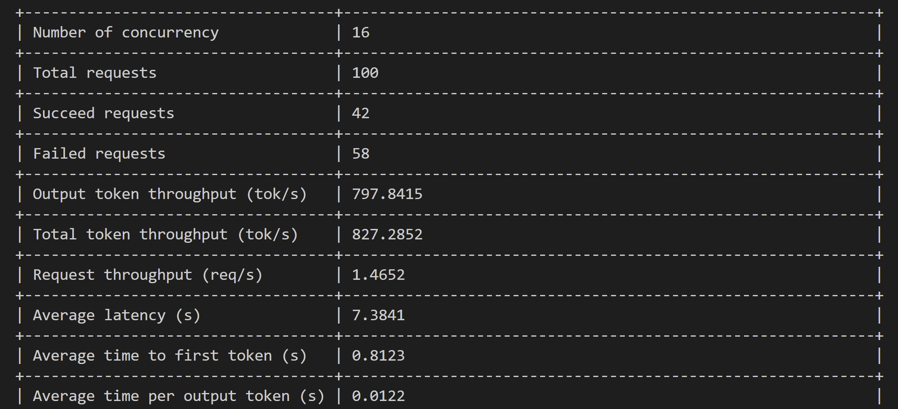
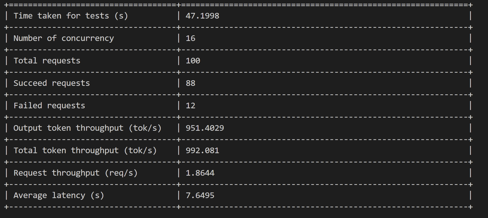

# Free SophNet API 代理

> **声明：**  
> 仅供网络安全学习交流使用 
> 请在24小时内删除，造成的任何后果与项目开发者无关

这是一个轻量级的 API 代理服务，专注于转发请求到 SophNet API 服务。支持流式响应输出，API 密钥映射，自动获取匿名 token，以及 IP 访问控制。

## 功能特点

- 兼容 OpenAI `/v1/chat/completions` 接口格式
- 支持流式输出 (SSE)
- 支持自动获取 SophNet 匿名 token
- 支持自定义转发目标路径
- 支持请求字段别名映射（如 model 到 model_id）
- 支持 OpenAI Function Calling 与 Tools 功能
- API 密钥映射，便于管理和保护实际 API 密钥
- IP 白名单/黑名单访问控制
- 可配置的请求和响应日志记录
- 支持 HTTP 代理
- 健康检查 API
- 支持获取模型列表
- 该接口也支持function call/tool call功能

## 快速开始

### 配置

1. 复制示例配置文件并根据需要修改：

   ```
   copy config.yml.example config.yml
   ```

2. 编辑 `config.yml` 文件，设置你的配置参数。

### 启动服务

在 Windows 系统上：

```
python openai_chat_proxy.py
```

服务默认在 `0.0.0.0:8000` 上启动，可以通过修改代码中的端口号来更改。

### 启动服务(docker)

```
docker compose up -d
```

## 使用方法

服务启动后，可以将原本发送到 OpenAI API 的请求改为发送到：

```
http://localhost:8000/v1/chat/completions
```

在请求头中使用你在配置文件中设置的前端密钥：

```
Authorization: Bearer your_frontend_key
```

服务会自动将其映射为实际的 SophNet API 密钥或自动获取匿名 token。

### 自定义转发路径

你可以在配置文件中设置 `proxy_url_path` 参数来自定义转发目标的路径。例如：

```yaml
# 将请求转发到 SophNet 特定路径
proxy_url_path: "/api/open-apis/projects/Ar79PWUQUAhjJOja2orHs/chat/completions"
```

### 字段别名映射

你可以在配置文件中设置 `field_aliases` 参数来自定义请求JSON数据中字段名的转换规则：

```yaml
field_aliases:
  "model": "model_id"  # 将请求中的model字段转换为model_id
```

使用此配置，当发送以下请求时：

```json
{
  "model": "DeepSeek-V3-Fast",
  "messages": [
    {
      "role": "user",
      "content": "你好"
    }
  ],
  "temperature": 0,
  "stream": true
}
```

服务会自动将其转换为以下格式后再转发：

```json
{
  "model_id": "DeepSeek-V3-Fast",
  "messages": [
    {
      "role": "user",
      "content": "你好"
    }
  ],
  "temperature": 0,
  "stream": true
}
```

字段别名功能会递归应用到嵌套的对象和数组中，非常适合处理复杂的JSON结构。

### 请求示例

使用 curl 发送请求：

```powershell
curl -X POST http://localhost:8000/v1/chat/completions `
  -H "Content-Type: application/json" `
  -H "Authorization: Bearer your_frontend_key" `
  -d '{
    "model": "DeepSeek-V3-Fast",
    "messages": [{"role": "user", "content": "你好"}],
    "stream": true
  }'
```

## 依赖库

需要安装以下 Python 依赖：

```
pip install aiohttp fastapi uvicorn loguru orjson pydantic pyyaml uvloop httptools
```

或使用项目的 pyproject.toml 安装：

```
pip install -e .
```

## 健康检查

可以通过访问 `/health` 端点来检查服务是否正常运行：

```
http://localhost:8000/health
```

## 获取模型列表

可以通过访问 `/v1/models` 端点查询可用的模型：

```
http://localhost:8000/v1/models
```


## 如何获得更好的性能？

研究发现性能瓶颈在于官网对/chat/completions接口的rate limit。因此解决方案是使用代理池发出请求以尽量减少被限制的次数。

在config.yml中配置代理：
```
# 代理服务器URL(如果需要)
# 示例: socks5://127.0.0.1:7890 推荐使用socks5
```

同时，在config.yml中设置参数：
```
keepalive_timeout: 0
force close: true
```

当配置了proxy，脚本会自动将请求头中的x-real-ip等字段统一设置为当前发起请求的IP地址。虽然实测没有太多差别；

压测命令：
```
evalscope perf \
    --url "http://127.0.0.1:8000/v1/chat/completions" \
    --parallel 16 \
    --model "DeepSeek-V3-Fast" \
    --number 100 \
    --api openai \
     --api-key "sk-2jc7k79eca#" \
    --dataset openqa \
    --stream
```

优化前：


使用上述优化后效果：


如果有更好的方法，欢迎交流！
